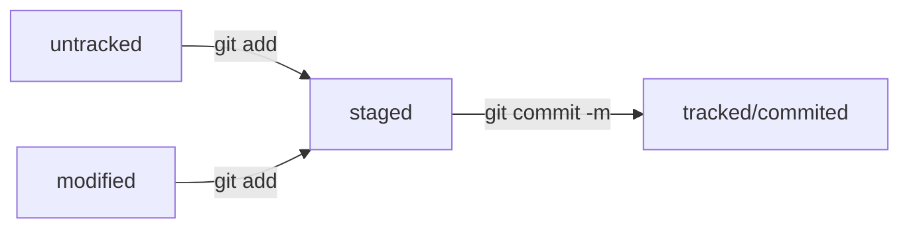

# Информация о Git и GitHub

## Git. Основные команды консоли

### Навигация

`pwd` - (**p**rint **w**orking **d**irectory - показать рабочую папку) показать путь к рабочей папке  
`ls` - (**l**i**s**t directory contents - отобразить содержимое директории») показать содержимое рабочей папки  
`ls -a` - показать также скрытые файлы и папки, названия которых начинаются с символа "."  
`cd` - (**c**hange **d**irectory - сменить папку) перейти в папку, путь к которой указан после cd  
`cd ..` - перейти на уровень вверх  
`cd ~` - перейти в домашнюю директорию  
`cd /` - перейти в корневую директорию (для Windows нужно указать название диска)  

### Работа с файлами и папками

#### Создание

`touch index.html` - (коснуться) - создать файл *index.html* в рабочей папке  
`touch index.html style.css script.js` - если нужно создать несколько файлов, можно написать их через пробел  
`mkdir` - (make directory - создать папку) создание папки в текущем месторасположении. После mkdir нужно указать имя папки.  

#### Копирование и перемещение

`cp file.txt ~/my-dir` - (copy - копировать) скопировать файл *file.txt* в ~/my-dir  
`mv file.txt ~/my-dir` - (move - переместить) переместить файл *file.txt* в ~/my-dir  

#### Чтение

`cat file.txt` - (con*cat*enate and print - объединить и распечатать) вывести содержимое файла *file.txt*  

#### Удаление

`rm about.html` - (remove - удалить) удалить файл *about.html*  
`rmdir images` - удалить папку *images* (для пустых папок)  
`rm -r second-project` - удалить папку *second-project* вместе с содержимым.  

### Полезные возможности

- Можно выполнить две команды в одной строке, если разделить их амперсандами `&&`  
- Консоль запоминает последние команды. Переключаться между ними можно клавишами `↑` и `↓`  
- Чтобы не вводить название папки полностью, можно нажать `Tab`. Если вариант заполнения единственный, название допишется, в другом случае выведет список вариантов.  

### Работа с локальным репозиторием

`git init` - сделать текущую папку репозиторием. Создастся скрытая папка *.git*  
`-rm -rf .git` - удаляем скрытую папку *.git*. `-r` означает "recursive" - рекурсивно, т.е. вместе с содержимым, `-f` - "force", заставить, убирает предупреждения "Вы точно хотите удалить эту папку?"  
`git status` - проверить состояние  
`git add index.html` - добавить файл *index.html* в репозиторий  
`git add --all` - добавить все файлы  
`git add .` - добавить текущую папку целиком  
`git commit index.html -m "Добавлен файл index.html"` - сохранить файл *index.html* в репозиторий. Сохраняет только добавленные. После ключа *-m* нужно ввести сообщение c изменениями  
`git log` - просмотреть историю коммитов  

---

## GitHub

### Создание репозитория

Зайти на https://github.com/username . Перейти на вкладку "Repositories", нажать кнопку "New". Ввести название. Оно необязательно должно совпадать с названием папки на компьютере, но во избежание путаницы стоит назвать ее так же. Выбрать тип - "Public" или "Private", нажать "Create repository".

### SSH-ключи (Secure Shell)

Данный раздел лучше выполнять не по шпаргалке.  

Ключи обычно находятся в домашней директории в папке *.ssh/*  

#### Генерация SSH-ключа

`ssh-keygen -t ed25519 -C "электронная почта"` - команда для генерации ssh-ключа по алгоритму шифрования ed25519  
`ssh-keygen -t rsa -b 4096 -C "электронная почта"` - команда для генерации ssh-ключа по алгоритму шифрования rsa.  

Кодовая фраза при создании необязательна.  

Создастся два ключа - публичный (с расширением *pub*) и приватный (без расширения). **ПРИВАТНЫЙ НЕ КОПИРОВАТЬ И НЕ ОТПРАВЛЯТЬ НИКОМУ**  

#### Привязка GitHub к Git по публичному SSH-ключу
 
**Windows:**  
Cкопировать содержимое ключа в буфер обмена:  
` clip < ~/.ssh/id_rsa.pub ` 
*для ed25519:*  
` clip < ~/.ssh/id_ed25519.pub  ` 
**macOS:**  
Cкопировать содержимое ключа в буфер обмена:  
` pbcopy < ~/.ssh/id_rsa.pub ` 
*для ed25519:*  
` pbcopy < ~/.ssh/id_ed25519.pub ` 

В GitHub: Settings -> New SSH key. *Title* = **Personal key**, *Key Type* = **Authentication Key**. В поле *Key* вставить содержимое буфера обмена.  

#### Проверка привязки ключа

`ssh -T git@github.com `  

Ссылка c ключами GitHubs: https://docs.github.com/en/authentication/keeping-your-account-and-data-secure/githubs-ssh-key-fingerprints

#### Привязка локального репозитория к репозиторию на GitHub

`git remote add origin git@github.com:%ИМЯ_АККАУНТА%/first-project.git` - команда для связывания двух репозиторием. Необходимо передать два параметра: имя удалённого репозитория и его URL. В качестве имени использовано origin (главный репозиторий, обычно один), а url нужно скопировать с GitHub со страницы репозитория.  
`git remote -v` - проверка связи между репозиториями. Флаг *-v*  - короткая форма флага --verbose ("подробный").

#### Ветки

Если коммит — это снимок состояния файлов, то ветка — временна́я шкала, на которой расположены эти снимки. Ветка всегда начинается от одного из коммитов.  
В репозитории может существовать сразу несколько веток — параллельных историй изменений. Также они могут соединяться друг с другом.  
Самая первая ветка в репозитории появляется автоматически и называется *main* (англ. «основная») или *master*.  

#### Отправка изменений на удаленный репозиторий

`git push -u origin main` - команда для отправки изменений на сервер в первый раз. Если команда приведёт к ошибке, попробуйте заменить main на master.  
`git push` - команда для отправки изменений.

---

## Хеш - идентификатор коммита

Содержит следующую информацию: когда сделан коммит, содержимое файлов в репозитории на момент коммита и ссылка на предыдущий или **родительский** коммит. Хранится в папке *.git*  

Git хеширует информацию о коммите с помощью алгоритма SHA-1. Обычно хеш - это короткая строка (40 символов в случае SHA-1), которая состоит из цифр 0-9 и латинских букв A-F.  

Два важных свойства:  

- если хеш получить дважды для одного и того же набора входных данных, то результат будет гарантированно одинаковый;  
- если хоть что-то в исходных данных поменяется (хотя бы один символ), то хеш тоже изменится (причём сильно).  

## Работа с логами

`git log` - получить историю коммитов.  
`git log --oneline` - получить сокращенный лог. Выводит первые несколько символов хеша, по которым система может однозначно найти хеш среди других в репозитории, и комментарии. Число символом не фиксировано, подбирается Git-ом.  

## Файл HEAD

Один из служебных файлов папки *.git*. Хранит ссылку на служебный файл `refs/heads/master` - ссылку на хеш последнего коммита. Вместо хеша последнего коммита в командах можно указывать слово HEAD.

## Статусы файлов

`untracked` - неотслеживаемый. Созданный, но не сохраненный с помощью `git add`.  
`tracked ` - все остальные файлы.  
`staged` - "подготовленный". После выполнения команды `git add` файл попадает в *staging area*, т.е в список файлов, которые войдут в коммит. В этот момент файл находится в состоянии `staged`. Есть синонимы - `indexed`, 'cached'.  
`modified` - "измененный". Состояние modified означает, что Git сравнил содержимое файла с последней сохранённой версией и нашёл отличия. Например, файл был закоммичен и после этого изменён.  

- Файл может одновременно находиться в статусах `staged` и `modified`, если был сохранен с помощью `git add`, а затем в него были внесены правки.  
- `staged` и `modified` входят в статус `tracked`.

## Жизненный цикл файлов в Git

## Оформление сообщений к коммитам

Коммит должен содержать: номер задачи, тип изменений, область изменений. Хорошо, когда:  

- сообщение коммита легко читается;  
- оно информативное;  
- все сообщения оформлены в одном стиле.  

Есть несколько популярных стилей оформления: **корпоративный**, **Conventional Commits**, **GitHub-стиль**. В GitHub-е можно вести список задач (issue) проекта, в этом случае при решении задачи удобно указывать в коммите ссылку на нее.  

Для сообщений на русском языке часто рекомендуют исопльзовать инфинитивы, на английском - императивы.

## Добавление изменений в последний коммит

`git commit --amend --no-edit` - (от англ. *amend*, «исправить») — добавь изменения к последнему коммиту и оставь сообщение прежним;  
`git commit --amend -m "Новое сообщение"` - измени сообщение к последнему коммиту на *Новое сообщение*.  
Выйти из редактора Vim: нажать Esc, ввести :qa!, нажать Enter.

## «Откат» файлов и коммитов

`git restore --staged hello.txt` - (от англ. *restore*, «восстановить») — переведи файл hello.txt из состояния staged обратно в untracked или modified;  

`git restore hello.txt` - верни файл hello.txt к последней версии, которая была сохранена через git commit или git add;  

`git reset --hard b576d89` - (от англ. *reset*, «сброс», «обнуление» + hard, «суровый») — удали все незакоммиченные изменения из staging и «рабочей зоны» вплоть до указанного коммита.

## Просмотр изменений

`git diff` - (от англ. *difference*, «отличие», «разница») — покажи изменения в «рабочей зоне», то есть в modified-файлах;  
`git diff a9928ab 11bada1` - выведи разницу между двумя коммитами;  
`git diff --staged` - покажи изменения, которые добавлены в staged-файлах.

## Клонирование чужого репозитория
`git clone git@github.com:YandexPraktikum/first-project.git` - (от англ. clone, «клон», «копия») — склонируй репозиторий с URL first-project.git из аккаунта YandexPraktikum на мой локальный компьютер.  

## Создание веток

`git branch feature/the-finest-branch` - (от англ. branch, «ветка») — создай ветку от текущей с названием feature/the-finest-branch;  
`git checkout -b feature/the-finest-branch` — создай ветку feature/the-finest-branch и сразу переключись на неё. 

## Навигация по веткам

`git branch` - (от англ. branch, «ветка») — покажи, какие есть ветки в репозитории и в какой из них я нахожусь (текущая ветка будет отмечена символом *);  
`git branch -a` — покажи все известные ветки, как локальные (в локальном репозитории), так и удалённые (в origin, или на GitHub).  
`git checkout feature/br` — переключись на ветку feature/br.

## Сравнение веток

`git diff main HEAD` (от англ. difference, «отличие», «разница») — покажи разницу между веткой main и указателем на HEAD;  
`git diff HEAD~2 HEAD` — покажи разницу между тем коммитом, который был два коммита назад, и текущим.

## Удаление веток

`git branch -d br-name` — удали ветку br-name, но только если она является частью main;  
`git branch -D br-name` — удали ветку br-name, даже если она не объединена с main.

## Слияние веток

`git merge main` (от англ. merge, «сливать», «поглощать») — объедини ветку main с текущей активной веткой.

## Работа с удалённым репозиторием

`git push -u origin my-branch` (от англ. push, «толкнуть», «протолкнуть») — отправь новую ветку my-branch в удалённый репозиторий и свяжи локальную ветку с удалённой, чтобы при дополнительных коммитах можно было писать просто git push без -u;  
`git push my-branch` — отправь дополнительные изменения в ветку my-branch, которая уже существует в удалённом репозитории;  
`git pull` (от англ. pull, «вытянуть») — подтяни изменения текущей ветки из удалённого репозитория.

## Feature branch workflow

Самый популярный подход к работе с Git в команде — это feature branch workflow. В нём создают ветку для каждой задачи (например, для новой функциональности или исправления бага), а когда всё готово, вливают новую ветку в main.  
Важные этапы этого процесса — пул-реквест и ревью изменений. Пул-реквест — это интерфейс, в котором можно обсудить изменения. Ревью — просмотр изменений другими участниками и один из способов проверить качество таких изменений.  
Если вы уже участник проекта (или collaborator в терминах GitHub), можно клонировать репозиторий напрямую. А если нет, нужно предварительно сделать «форк». Также для участников доступна кнопка Merge после ревью, а для неучастников — нет.  

## Конфликты слияния

Когда один и тот же файл меняется в нескольких ветках, при их слиянии может произойти конфликт. Пугаться конфликтов не нужно, это нормальная часть работы с системами контроля версий. IDE, вроде VSCode или Intellij IDEA, помогут «склеить» файл из двух конфликтующих версий. 

## Алгоритм-шпаргалка для создания PR

1. Склонировать репозиторий.  
    1.1 Если вы не участник проекта, предварительно сделать «форк» исходного репозитория.  
    1.2 На странице репозитория или «форка» нажать кнопки: Code → SSH → скопировать ссылку.  
    1.3 Выполнить команду git clone <ссылка на репозиторий>.  
2. Создать ветку для вашей задачи: git checkout -b my-task-branch-name.  
3. Добавить и «закоммитить» изменения, которые вы хотите внести в проект.  
4. «Запушить» ветку: git push --set-upstream origin HEAD или git push -u origin my-task-branch-name.  
    4.1 GitHub (с помощью Git) выведет ссылку на создание PR. По ней нужно перейти.  
    4.2 PR можно также создать через интерфейс GitHub.  
5. Сообщить о пул-реквесте ревьюеру.  
    5.1 Иногда ревьюеры назначаются автоматически, тогда сообщать не нужно.  
6. Обсуждать с ревьюером предлагаемые изменения и вносить правки, пока эти изменения не будут одобрены (пока не будет получен «апрув»).  
    6.1. Если кто-то добавил конфликтующие изменения в main, пока ваш PR был на ревью, нужно разрешить конфликт:   
    - Обновить main: git checkout main && git pull.  
    - Влить main в свою ветку: git checkout my-task-branch-name && git merge main.  
    - Разрешить конфликты слияния с помощью IDE или вручную.  
    - Создать коммит слияния: git commit --no-edit или git commit -m 'merge main'.  
    - Сделать git push своей ветки.  
7. Нажать кнопку Merge или подождать, пока её нажмёт кто-то ещё.  
8. Ещё раз обновить main, чтобы «подтянуть» ваши изменения в основную ветку локального репозитория: git checkout main && git pull.  
9. Вы великолепны! Можете начинать снова со второго пункта.  

## Алгоритм-шпаргалка для разрешения конфликтов слияния

1. Открыть проект в IDE (VS Code, IDEA или другие).  
2. Открыть файл, в котором есть конфликт.  
3. Выбрать, какие части файла нужно взять из одной ветки, а какие — из другой.  
4. Когда конфликты разрешены, сделать коммит: git commit --no-edit или git commit -m 'merge branch <название ветки>'.  